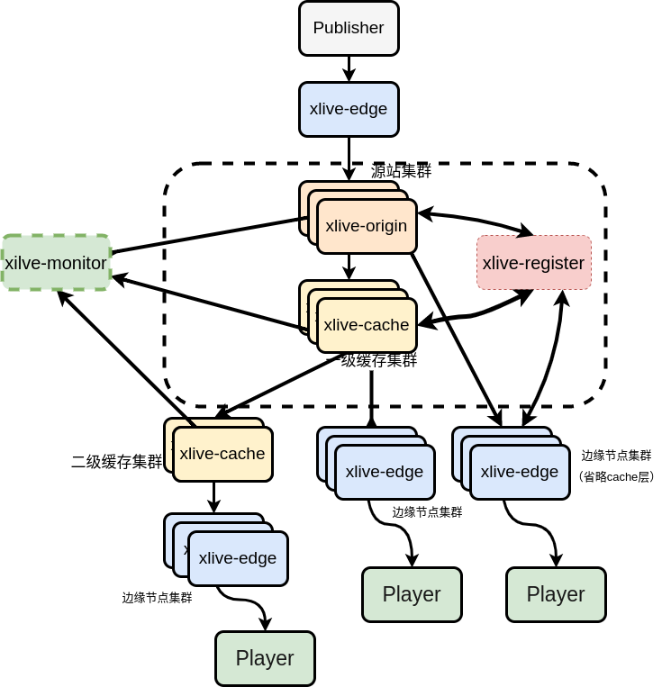

# xlive-cluster

`xlive-cluster`是纯rust实现的直播服务，采用分层架构，集群部署。核心服务，可以做到无状态（stateless），可以很方便进行横向拓展。

## 包含五大大组件

### xlive-origin(源站)

`xilve-origin`属于流服务器源站，源站没有实现直播协议（`rtmp，http-flv,hls`等）。推流时先推到边缘节点，由边缘节点推到源站。拉流时，先到边缘节点，可能通过多级cache或者直连源站（大型直播，通常不建议）。

### xlive-cache（缓存层，小规模站可以省略）

`xlive-cache`属于中间缓存层，对视频源进行放大，保护源站，防止源站流量过大，每一层cache都有完整的`seq header，gop`等缓存，可以部署多层。建议在源站同机房中部署第一层cache，这样能很好保护源站，防止被下级爆量请求。

### xilve-edge (边缘节点)

`xilve-edge`属于边缘节点，主要处理直播协议到视频帧数据的编解码工作。推流情况下edge直连origin，拉流可以直连origin，或者中间可能经过多层cache。

### xlive-register(注册中心)

`xlive-register`属于注册中心，每一个`publisher`都会注册，相当于每个时刻会有所有`publisher`的一个快照。

### xlive-monitor（监控中心）

`xlive-monitor`可以收集`xlive-origin`，`xlive-edge`，`xilve-cache`的`publisher`和各层级的`player`数量，为调度算法提供更多依据。

## 架构示意图

## Features

- [x] 实现rtmp推流,拉流。
- [x] 支持H264/H265 
- [x] 可配置支持gop cache 
- [x] 支持http-flv.
- [ ] 支持hls拉流.
- [ ] 支持srt(h264/h265)推拉流
- [ ] 支持GB28181
- [ ] 支持Webrtc

## 联系我

wechat: widaWX(注明来意)